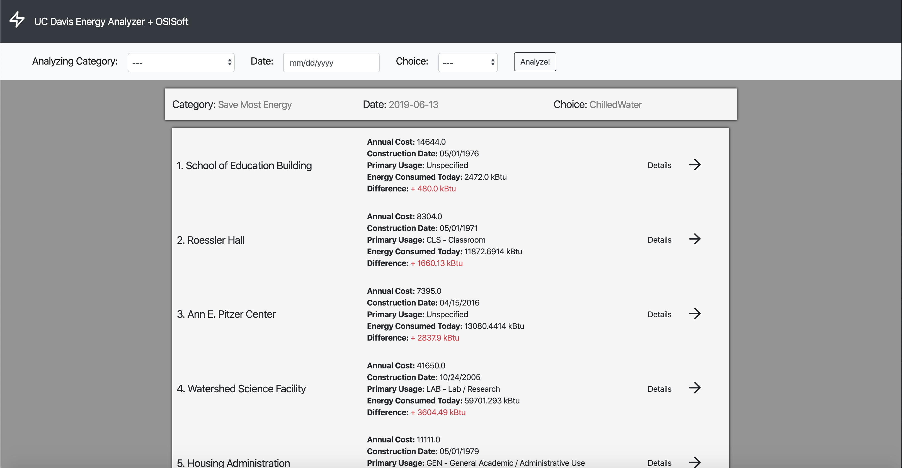
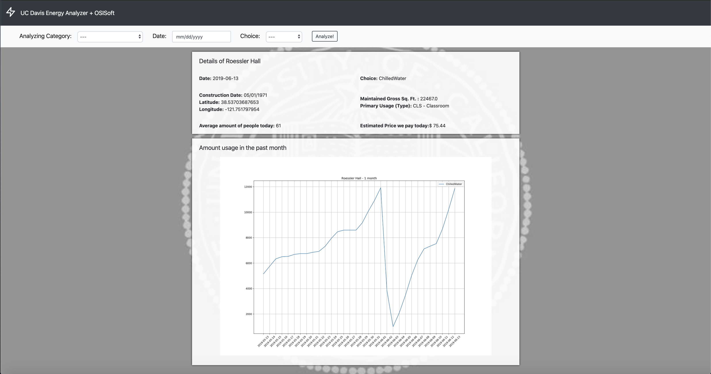
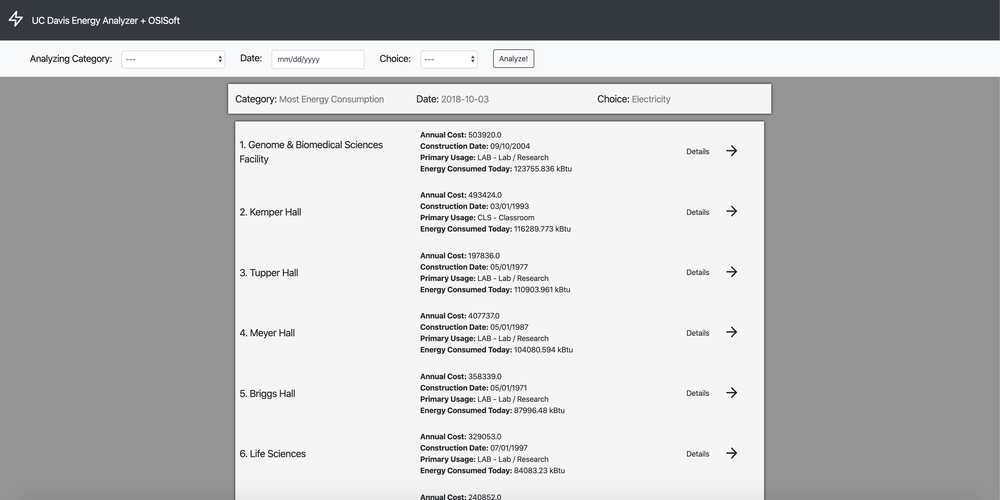
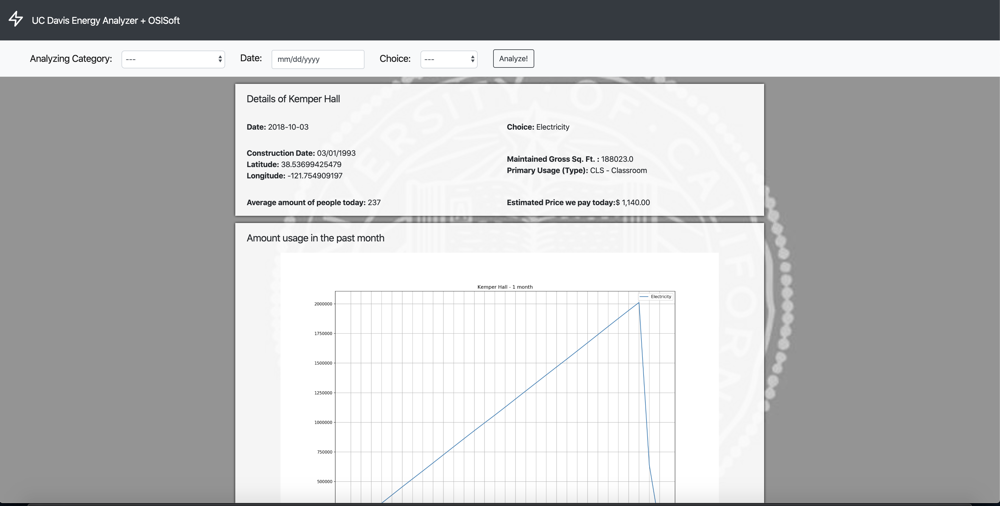

# UC_Davis_Energy_Analyzer

This application utilizes real-time data from OSISoft Cloud to compute and rank the amount of energy used by each building at UC Davis.

We breakdown the rankings into four categories:

1. Buildings with highest energy consumption
2. Buildings with lowest energy consumption
3. Buildings that save the most amount of energy for that day
4. Buildings that save the least amount of energy for that day

Here are some sample picture of our web application:

- This is the search results when the user asked for buildings that save the most energy at a given day

- This page shows the details of the building and the graph of the amount of energy usage in the past month

- Another search result when users input different indicators

- Another detail page of a different building

